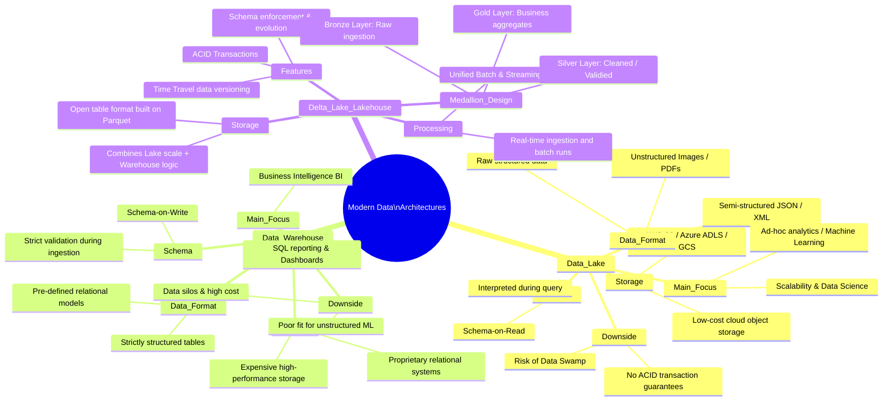

# Software Architecture & Development
- Paradigms: Monoliths, Microservices, Serverless, Event-Driven Architecture (EDA).
- Interfaces (APIs): REST, GraphQL, gRPC, WebSockets.
- Frontend Frameworks: React, Angular, Vue, Svelte.
- Backend Runtimes: Node.js, JVM (Java/Kotlin), .NET, Go, Rust.

# Data Management & Databases
- Relational Databases (RDBMS): PostgreSQL, MySQL, SQL Server.
- NoSQL Databases: MongoDB (Document), Redis (Key-Value/Caching), Cassandra (Wide-Column), Neo4j (Graph).
- Vector Databases (highly relevant): Pinecone, Milvus, Qdrant (essential for AI/RAG).
- Data Modeling & Architecture: 3rd Normal Form (3NF/OLTP), Star/Snowflake Schema (Kimball/Inmon), Data Vault 2.0, One Big Table (OBT/Flat Tables)
- Data Governance & Quality: Data Catalogs (Collibra, Apache Atlas), Data Lineage, Master Data Management (MDM)

# Cloud Platforms & Cloud Native
- Public Cloud Providers: AWS, Microsoft Azure, Google Cloud Platform (GCP).
- Cloud Strategies: Multi-Cloud, Hybrid Cloud, Sovereign Cloud (privacy-focused clouds).
- FinOps: Cloud cost optimization and budget governance.

# DevOps & Infrastructure (Platform Engineering)
- Containerization: Docker, Podman.
- Orchestration: Kubernetes (K8s), Nomad.
- Infrastructure as Code (IaC): Terraform, OpenTofu, Pulumi, Ansible.
- CI/CD Pipeline Tools: GitHub Actions, GitLab CI, Jenkins, ArgoCD.

# Data Engineering & Analytics
- Data Integration: ETL (Extract-Transform-Load), ELT, Reverse ETL.
- Streaming & Messaging: Apache Kafka, RabbitMQ, Apache Flink.
- Storage & Warehousing: Data Lakes (S3/Delta Lake), Data Warehouses (Snowflake, BigQuery).
- BI & Visualization: Power BI, Tableau, Looker.

# IT Security (Cybersecurity)
- Identity Management: IAM, OAuth 2.0, OIDC, Active Directory.
- Network Security: Firewalls, VPNs, Zero Trust Architecture (ZTA).
- Application Security: SAST/DAST (code scanning), encryption (AES, RSA).
- SIEM & SOC: Splunk, Datadog, Incident Response.

# Networking & Communication
- Protocols: TCP/IP, HTTP/3, MQTT (for IoT), DNS.
- Infrastructure: Content Delivery Networks (CDN), Load Balancers, VPCs.
- Edge Computing: Cloudflare Workers, AWS Greengrass.

# Artificial Intelligence & ML (Beyond LLMs)
- Classical ML: Regression, Clustering, Random Forests (Scikit-Learn).
- Deep Learning: Computer Vision, CNNs, RNNs (PyTorch, TensorFlow)
- Generative AI & LLMs (Transformers, RAG, Vector Search, Prompt Engineering, frameworks such as LangChain/LlamaIndex)
- MLOps: MLflow, Kubeflow, Feature Stores (data and model lifecycle).

# Quality Management, Testing & Observability
- Testing Types: Unit, Integration, End-to-End (E2E), and Load Testing (Playwright, Cypress, JMeter).
- Observability (APM): Metrics, Logs, and Traces (Prometheus, Grafana, OpenTelemetry, Jaeger)

# IoT & Embedded Systems (Hardware-Close IT)
- Firmware & Embedded: C/C++, Rust for microcontrollers (ESP32, ARM).
- Protocols & Hardware: BLE (Bluetooth), Zigbee, LoRaWAN, CAN bus

# Mobile & Desktop
- Native Mobile: Swift (iOS), Kotlin (Android).
- Cross-Platform / Hybrid: Flutter, React Native.
- Desktop Frameworks: Electron, Tauri (important for desktop apps with web technologies)

# Operating Systems & Virtualization
- Operating Systems: Linux (Ubuntu, RHEL, Alpine - absolutely essential for DevOps), Windows Server.
- Classical Virtualization (Hypervisors): VMware vSphere/ESXi, KVM, Proxmox (important for on-premises and hybrid cloud)

# Modern Workplace & Collaboration
- SaaS Suites: Microsoft 365, Google Workspace.
- Device Management (MDM): Microsoft Intune, Jamf (management of company laptops and phones)

# Legacy & Enterprise Infrastructure
- Mainframe / Large Systems: IBM z/OS, COBOL (still the backbone of global finance).
- Enterprise Resource Planning (ERP): SAP (S/4HANA), Salesforce

# Web3 & Decentralized Technologies (Crypto & Ledger)
- Blockchains & Distributed Ledger (DLT): Ethereum, Hyperledger Fabric (Enterprise), Solana.
- Concepts: Smart Contracts (Solidity, Rust), Decentralized Identities (DID)

# Spatial & Immersive Computing (Spatial Computing / XR)
- Technologies: Augmented Reality (AR), Virtual Reality (VR), Mixed Reality (MR).
- Engines & SDKs: Unity, Unreal Engine, visionOS, WebXR

# Data management architectures

